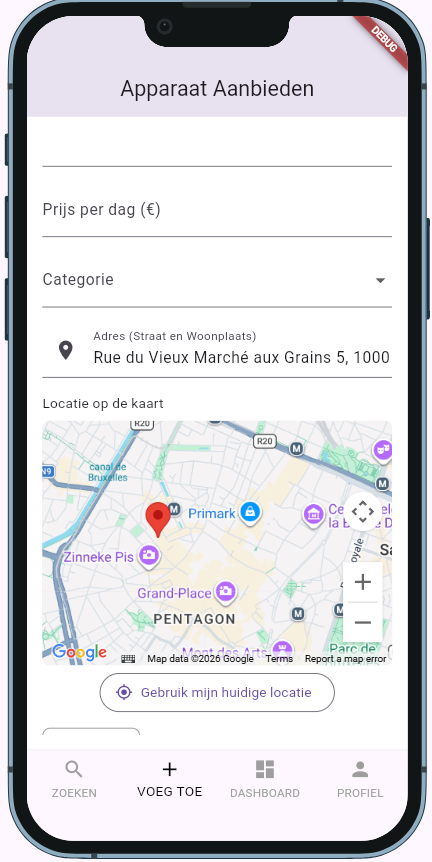
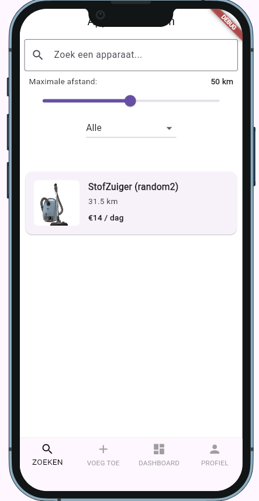
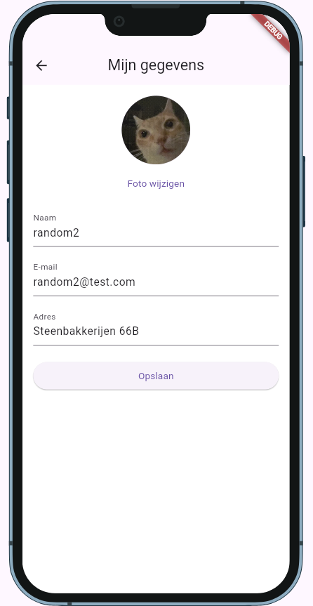
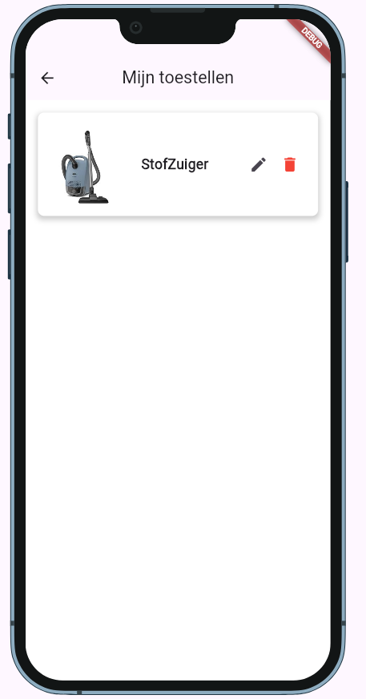
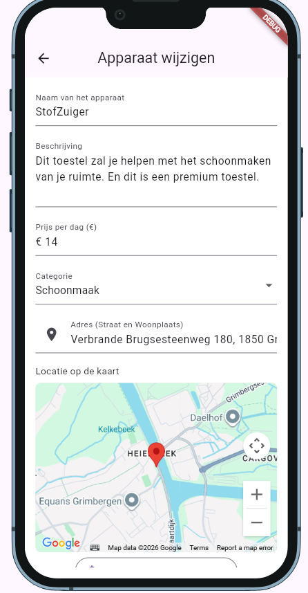
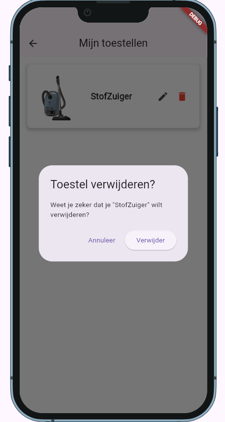

# Verslag BuurShare

In dit verslag leg ik twee features uit die ik heb toegevoegd aan de BuurShare app:

1. Google Maps feature
2. Mijn Toestellen feature (wijzigen en verwijderen)

---

## 1. Google Maps feature

We heb Google Maps in de app gezet zodat gebruikers kunnen zien waar een apparaat zich bevindt en zodat ze kunnen filteren op afstand.

### Wat doet het?

- Bij het **toevoegen** van een apparaat kan de gebruiker een locatie kiezen op de kaart. De locatie wordt opgeslagen in Firestore.
- Bij het **wijzigen** van een apparaat kan de locatie aangepast worden.
- In het **zoekscherm** is er een kaart te zien met alle apparaten in de buurt. Er is ook een schuifbalk (slider) waarmee je de afstand kan instellen, zodat je alleen apparaten ziet die dichtbij zijn.

### Screenshots

> **Screenshot 1:** Toevoegen scherm met de kaart waarop je een locatie kan kiezen
> 

> **Screenshot 2:** Zoekscherm met de kaart en de afstand-slider
> 

> **Screenshot 3:** Wijzigen scherm waar je de locatie van een bestaand apparaat aanpast
> 

---

## 2. Mijn Toestellen feature (wijzigen en verwijderen)

In het scherm "Mijn Toestellen" kan een gebruiker zijn eigen apparaten beheren. Hij kan ze aanpassen of helemaal verwijderen.

### Wat doet het?

- De gebruiker ziet alleen zijn **eigen apparaten** (gefilterd op `eigenaar == currentUser.uid`).
- Bij elk apparaat staan twee knoppen: **Wijzigen** en **Verwijderen**.
- Met **Wijzigen** ga je naar het `WijzigenScherm`. Daar kan je de naam, beschrijving, prijs, foto en locatie aanpassen.
- Met **Verwijderen** wordt het apparaat uit de database gehaald. Ook alle huuraanvragen die bij dat apparaat horen worden meteen verwijderd (batch delete), zodat er geen "losse" aanvragen achterblijven.

### Screenshots

> **Screenshot 4:** Mijn Toestellen scherm met de lijst van eigen apparaten en de knoppen Wijzigen/Verwijderen
> 

> **Screenshot 5:** Wijzigen scherm met ingevulde gegevens
> 

> **Screenshot 6:** Bevestigings-dialog voor het verwijderen van een apparaat
> 
